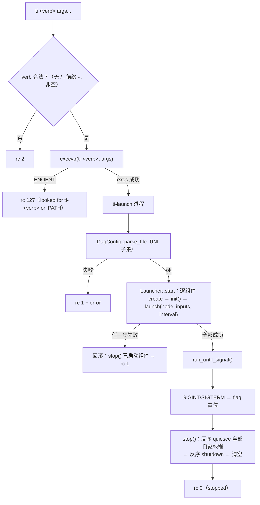
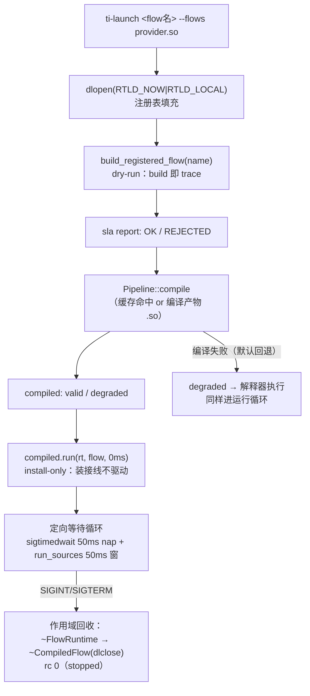

# ti CLI 家族与装载器（`tianshu/cli` + `core::Launcher`）

> 状态：✅ 已实现——`ti` / `ti-launch` / `ti-monitor` / `ti-info` / `ti-compile` 五个二进制 + core 侧 `DagConfig`/`Launcher` 装载器（`ti-ctl`/`ti-console` 属规划，见 §7）
> 代码：`tianshu/cli/{ti_main, ti_launch_main, ti_monitor_main, ti_info_main, ti_compile_main}.cc` · `tianshu/include/tianshu/core/launcher.h` + `tianshu/src/launcher.cc`
> 关键 ADR：[ADR-0002 与 Cyber RT 的关系](../../adr/0002-cyber-relation.md)（术语节：`ti`+`ti-*` 命名与被否名） · [ADR-0014 Console](../../adr/0014-console.md)（ti-console Phase 3 规划） · [ADR-0020 消息反射与 Monitor](../../adr/0020-message-reflection-monitor.md)（ti-monitor 解析链） · [ADR-0029 SLA](../../adr/0029-sla-compilation.md)（ti-info `--calibrate` H3 回路） · [ADR-0038 H3 验证语义](../../adr/0038-h3-verification-semantics.md)（`--wcet` 漂移比对） · [ADR-0030 L1 编译器](../../adr/0030-l1-compiler.md)（ti-compile 离线编译，M-B）
> 测试：`tests/core/launcher_test.cc`（16 用例：DagConfig 解析 / Launcher 生命周期 / `ti` 派发冒烟） · `tests/cli/ti_info_calibrate_test.cc`（6 用例：calibrate 输出与 `--wcet` rc 契约） · `tests/cli/ti_compile_test.cc`（7 用例 + provider 库 `ti_compile_test_flows.cc`） · `tests/cli/ti_launch_flow_test.cc`（4 用例 + provider 库 `ti_launch_flow_test_flows.cc`） · 示例：`examples/hello_dag.cc` + `examples/hello.flow` · H3 装置：`benchmarks/h3_wcet_rig.cc` + `tools/h3_shield.sh`
> 最后同步：2026-09-18（ti-compile 落地 + ti-launch flow 模式接线（ADR-0030 M-B/M-D）+ `ti` 动词探测表补 `compile`/`info`；未提交，待维护者过目）

## 1. 职责与边界（做什么 / 明确不做什么）

**做什么**：

- **`ti`（统一入口）**：kubectl / docker 插件模式的 dispatcher——`ti <verb> [args...]` 经 `execvp` 执行 PATH 上的 `ti-<verb>` 二进制；`ti` 只派发**永不重实现**工具，新 `ti-*` 二进制零成本进统一入口。verb 合法性校验（拒 `/` `.` 前缀 `-`）；无参时探测可用动词打印 usage。
- **`ti-launch`（DAG 装载器 + flow 运行器）**：双模式——`ti-launch <flow.dag> [--mode intra|shm]` 解析 INI 子集 `DagConfig`，经 `core::Launcher` 装配组件图（工厂创建 → `init()` → `launch()`），`Ctrl-C`/SIGTERM 反序停机，等价 cyber `mainboard -d xxx.dag`（ADR-0002 兼容表）；`ti-launch <flow名> [--flows PATH]...` 走 ADR-0030 M-D 闭环：按名 dry-run trace → SLA 判定 → `Pipeline::compile` → 安装编译产物运行至 SIGINT/SIGTERM（§3.4）。参数解析顺序 LOCKED：位置参数是**现存可读文件** → DagConfig 模式（向后兼容），否则按 flow 名查注册表。
- **`ti-monitor`（通道监视 TUI）**：`ti-monitor <channel>... [--depth N] [--once] [--decode TYPE]`——cyber_monitor 等价物：通道列表（Hz/size）+ 详情面板（schema 解码字段或 hex dump）；vi 风键位（`j/k` 选通道、`SPACE/p` 暂停回看、`h/l` 帧步进、`CTRL-D/U` 跳 16 帧、`g/G` 首末帧、数字前缀如 `5j`）；`--once` 无头模式供 CI（每通道等首帧 3s，打印一行摘要，0 ok / 1 timeout）。
- **`ti-info`（record 检查器）**：`ti-info <file.trec> [--messages N] [--lineage] [--calibrate [--wcet NAME=US[,...]]]`——不链接发布者代码即可读 Tianshu Record v2：摘要（版本/通道/消息数/字节/时长）、逐通道统计（count/bytes/type/rate）、消息预览（含血缘 describe）；`--calibrate` 执行 ADR-0029 H3 校准回路（§3.3）；`--wcet`（与 `--calibrate` 同用）把声明值与建议值比对，偏差 >3× 报 DRIFT-HIGH/LOW 并以 rc 3 退出（ADR-0038 D4）。
- **`ti-compile`（离线编译器，ADR-0030 M-B）**：`ti-compile <flow名> [--flows PATH]... [--cache-dir DIR] [--compiler CXX] [--emit-source] [--no-fallback]` / `--list`——按名 dry-run trace（build 即 trace，SLA 判定一行输出）→ `Pipeline::compile`（P4+P5）→ 产物 `.so` 与审计三件套（`.gen.cc` 由管线写、`.dag`/`.conf` 由 CLI 经 `IrGraph::export_*` 写，均在缓存目录）→ 打印 valid/degraded（degraded 带原因行，自动化可 grep）、产物路径、cache hit/miss。flow 注册表经 `--flows` dlopen provider `.so` 填充（§3.4）。
- **`core::Launcher`（库形态装载器）**：`DagConfig::parse/parse_file`（INI 子集，TOML 形状）+ `Launcher::start/run_until_signal/stop`——CLI 与示例（`hello_dag`）共用同一装配语义。

**明确不做什么**：

- **`ti` 不内置工具逻辑**：无 PATH 上的 `ti-<verb>` 即报错退出 127；派发不重新实现任何工具。
- **`ti-launch` 文件模式不消费编译产物**：`DagConfig` 路径装的是 core 组件图（`[component]` 节 + `ComponentFactory`）；flow 模式装的是 `Pipeline::compile` 产物/解释器（§3.4）——两条装载路径并存，融合是 Phase 2 议题（`IrGraph::export_dag()` 的 TOML 产物与 `DagConfig` 的迁移亦然）。
- **`DagConfig` 不是完整 TOML**：Phase 1 刻意子集（~100 行零依赖解析器），`[component <name>]` 节 + `type` / `inputs`（逗号分隔）/ `interval_ms` 三键，未知键/未知节/节外键一律报错；完整 TOML 待 [ADR-0016](../../adr/0016-config-format.md) 解析器归队。
- **`ti-monitor` 无跨机/发现能力**：通道靠显式参数指定（不扫总线），解码靠 `DecoderRegistry` + SHM sidecar（ADR-0020），查不到 schema 降级 hex dump——工具永远可用。
- **`ti-ctl`（ADR-0012 参数系统）/ `ti-console`（ADR-0014，Phase 3）未实现**。

## 2. 公共 API 速览

### 2.1 CLI 面（`tianshu/cli/`，五个独立 main）

| 二进制 | 用法 | 退出码约定 |
|---|---|---|
| `ti` | `ti <verb> [args...]`；无参 → usage + 已发现动词（rc 2）；verb 非法 → rc 2；`ti-<verb>` 不在 PATH → rc 127 | 派发成功后由子进程决定 |
| `ti-launch` | `ti-launch <flow.dag> [--mode intra\|shm]`（文件模式）；`ti-launch <flow名> [--flows PATH]...`（flow 模式，位置参数非现存可读文件即按名查注册表）；解析/装配失败、既非文件亦非注册 flow（stderr 双解释 + 注册名）→ rc 1，usage / flow 模式给 `--mode` / 文件模式给 `--flows` → rc 2 | 正常停机 rc 0（两种模式同） |
| `ti-monitor` | `ti-monitor <channel>... [--depth N] [--once] [--decode TYPE]`（depth 默认 512）；未知选项 rc 2，attach 失败 rc 1 | `--once`：全通道有帧 0 / 超时 1 |
| `ti-info` | `ti-info <file.trec> [--messages N] [--lineage] [--calibrate [--wcet NAME=US[,...]]]`；打不开/非 v2 → rc 1；`--wcet` 格式错/未知 stage/缺 `--calibrate` → rc 2 | 正常 rc 0；漂移（任一 stage 偏离建议值 >3×）→ rc 3 |
| `ti-compile` | `ti-compile <flow名> [--flows PATH]... [--cache-dir DIR] [--compiler CXX] [--emit-source] [--no-fallback]`；`--list [--flows PATH]...`；未知 flow（stderr 列已注册名）/ provider 加载失败 / `--no-fallback` 下编译失败 → rc 1；usage 错误（无参/未知选项/缺值/多位置参）→ rc 2 | 成功 rc 0——valid，或默认回退下的 degraded（打印 `degraded: <原因>` 行）；`--list` rc 0 |

### 2.2 库面（`core/launcher.h`，namespace `tianshu::core`）

| 类型 / 函数 | 说明 |
|---|---|
| `DagComponentConfig` | `name` · `type`（工厂注册名）· `input_channels`（`vector<string>`）· `interval`（`chrono::milliseconds`，0 = 事件驱动） |
| `DagParseResult` | `components` · `error` · `ok()` |
| `DagConfig::parse(text)` / `parse_file(path)` | 静态：INI 子集解析；`#`/`;` 注释；错误即整体失败（无部分结果） |
| `Launcher(mode)` | 构造传 `transport::TransportMode`（默认 `kIntra`），持一个 `Node` |
| `Launcher::start(dag, *error)` | 逐组件 `ComponentFactory::create` → `init()` → `launch(node, inputs, interval)`；中途失败**回滚**已启动组件后返回 false |
| `Launcher::run_until_signal()` | 阻塞至 SIGINT/SIGTERM 再 `stop()`（定向等待实现，见 §3.1） |
| `Launcher::stop()` | 反序 `quiesce()` 全部自驱线程 → 反序 `shutdown()` → 清空 |
| `Launcher::components()` | `vector<unique_ptr<ComponentBase>>` 只读访问（测试/示例 introspection 用） |

`ti-monitor` 的交互面来自 `core/monitor.h` 的 `MonitorApp`（`add_channel` / `snapshot` / `pause` / `resume` / `select_delta` / `step_frame` / `jump_frame_by/first/last` / `wait_first_frames`）；`ti-info` 的数据面来自 `dsl/record_v2.h` 的 `RecordReader`（`open` / `next` / `channels` / `find_channel` / `stats` / `major_version`）——两者属 core / dsl 模块，CLI 只做渲染与编排。

### 2.3 真实用法（摘自示例 / 测试）

```text
# 来源：examples/hello.flow —— ti-launch 消费的 DAG 文件（与 hello_dag.cc 同格式）
[component source]
type = hello_source
interval_ms = 100

[component doubler]
type = hello_doubler
inputs = /demo/count
```

```cpp
// 来源：examples/hello_dag.cc —— Launcher 库形态（ti-launch 的同语义进程内版）
const auto dag = tianshu::core::DagConfig::parse_file("examples/hello.flow");
tianshu::core::Launcher launcher;                 // INTRA 模式
std::string error;
if (!launcher.start(dag, &error)) { /* ... */ }   // 工厂创建 + init + launch
std::this_thread::sleep_for(std::chrono::milliseconds(1500));
launcher.stop();                                  // 反序 quiesce → shutdown

// 来源：tests/core/launcher_test.cc（TiDispatchTest）—— ctest 经 TI_BIN_DIR 冒烟：
// execl(ti, "ti", "launch", "/nonexistent.flow") 必须由 ti-launch 接管
// （exit 1 = ti-launch 报缺文件；127 则说明 ti 派发本身失败）
```

```text
# 来源：ti_monitor_main.cc 头注释 —— 键位契约
#   j / k 选择通道 · SPACE 或 p 暂停/恢复 · h / l 前后帧（暂停时）
#   CTRL-D / CTRL-U 跳 16 帧 · g / G 首末帧 · q 退出；支持计数前缀（5j）
```

```text
# 来源：tests/cli/ti_compile_test.cc —— ti-compile 的 provider-.so 形态
ti-compile single_chain --flows libti_compile_test_flows.so --cache-dir /tmp/gen
#   sla report: OK
#   compiled: valid
#   artifact: /tmp/gen/single_chain.<hash>.so
#   cache: miss
#   exported: /tmp/gen/single_chain.<hash>.dag
#   exported: /tmp/gen/single_chain.<hash>.conf
```

## 3. 内部设计

### 3.1 `ti` 派发与 `ti-launch` 生命周期



- **派发器即协议**：`ti` 用 `execvp` 原地替换进程（非 fork）——无中间层、信号语义干净；工具自测可用 `PATH=<bindir>:$PATH ti <verb>` 复现。动词发现走**探测而非扫目录**（对计划内家族 `{launch, monitor, compile, info, console, ctl, inspect}` 逐个 `stat + access(X_OK)`），保持廉价。
- **`run_until_signal` 的定向等待**：同步 handler 只翻 flag，主循环 `sigtimedwait(空集, 50ms nap)` 醒来观察——**不是**裸 `pause()`（多线程进程里异步 handler 可能在别的线程跑，本线程 `pause` 会永久睡眠，SIGTERM 测试复现过）也**不是**裸 `sigwait`（block mask 是 per-thread 的，信号落在未屏蔽线程上会直接杀进程）。该取舍以注释形式存档在 `launcher.cc`。
- **停机两段式**：先反序 `quiesce()` **全部**自驱线程，再反序 `shutdown()`——in-flight 定时 publish 会同步 dispatch 进别的组件的 Writer/CacheBuffer，必须先全员停车再拆状态（`launcher.cc` 注释）。
- **`--mode` 直通 `TransportMode`**：`ti-launch` 只认 `intra|shm`（未知值 rc 2），传给 `Launcher` 构造 `Node`——跨进程部署即 `ti-launch x.flow --mode shm`。

### 3.2 `ti-monitor`：快照模型 + 终端保卫

- **渲染/逻辑分离**：`MonitorApp`（core）管缓冲与游标，TUI 每 100ms `poll(STDIN)` 醒来 `snapshot()` 重绘——渲染层无状态，`--once` 复用同一 `snapshot()` 做无头输出。
- **`TermGuard`**：进 raw 模式（`ICANON|ECHO` 关、`VMIN=VTIME=0`）+ 备用屏幕（`?1049h` / 隐藏光标），`leave()` 恢复——异常路径也不留脏终端。
- **解码优先级**：`--decode TYPE` > 通道 schema sidecar（`ChannelView.schema_type_name`，ADR-0020 Phase 2：`MonitorApp::add_channel` attach 时自动装载 `/tianshu_schema_<fnv1a>`）> hex dump；解码走 `DecoderRegistry::decode` 填 `FieldTreeView`，逐行 `name = value`。
- **计数前缀**：数字积累进 `pending_count`（上限 999），随下一个动作键消费（`5j` 下移 5 个通道；`g/G` 清零）。

### 3.3 `ti-info` 与 H3 校准回路（ADR-0029 Phase 1 · ADR-0038）

- **索引**：全文件单遍扫描建 `(channel_id << 48 | seq) → ts_ns` 索引；对每条带血缘跳的消息，**产出该消息的级的输入** = 倒数第二跳（单跳血缘则回退到 root）。
- **级时延**：`ts(out) − ts(命中的输入消息 ts)`，按输出通道聚合，排序取 P50 / P99 / P99.9。
- **WCET 建议** = `p99.9 × 1.3`（ADR-0029 H3 目标窗上界），表格输出 `STAGE(out<-in) / N / p50 / p99 / p99.9 / WCET_suggest`；反填 `with_wcet()` 由用户执行，v0 不自动改写。
- **漂移比对（`--wcet NAME=US[,...]`，ADR-0038 D4）**：表增 `DECLARED(us)` / `RATIO(decl/suggest)` 两列（未声明打 `-`）；`declared > 3 × suggest` → DRIFT-HIGH（过度保守）、`declared < suggest / 3` → DRIFT-LOW（不安全乐观）——ADR-0029 D2「偏差 >3×」的对称解读；任一 drift → rc 3，格式错/未知 stage/缺 `--calibrate` → rc 2。H3 验证装置（`benchmarks/h3_wcet_rig.cc` + `tools/h3_shield.sh`，证据 `h3-rounds/`）经此回路判定 PASS（2026-09-18，ADR-0038）。

### 3.4 ti-compile 与 ti-launch flow 模式（ADR-0030 M-B/M-D 接线）

**provider-.so 机制**：`REGISTER_TRACEABLE_FLOW` 的注册表是**进程内 static-init 侵入链**（`flow.h`：POD 节点在静态初始化期 CAS 挂链，零分配零抛出）——CLI 二进制天然只能看到**链接进来的翻译单元**注册的 flow。外部 flow 经 `--flows PATH` 进入：`dlopen(path, RTLD_NOW|RTLD_LOCAL)` 让 provider `.so` 的静态初始化在宿主进程里跑、其注册节点挂上链。选 `RTLD_NOW`（加载即解析全部符号，缺符号当场失败而非首调用时）+ `RTLD_LOCAL`（符号不进全局空间，多 provider 互不污染）。一个非显然的坑：注册表头是 **inline 函数的 static 局部**（GNU unique 符号）——宿主可执行文件必须 `--export-dynamic`（CMake `ENABLE_EXPORTS` / Bazel `-rdynamic`）才能与 provider 副本统一，否则 provider 注册进自己的头、CLI 读自己的头，互相看不见。

**参数解析顺序（ti-launch，LOCKED）**：位置参数先做 `stat + S_ISREG + access(R_OK)`——是**现存可读文件** → DagConfig 文件模式（原行为不动，向后兼容）；否则一律按 flow 名查注册表。`--mode` 属文件模式专用（flow 模式给 `--mode` → rc 2）；`--flows` 属 flow 模式专用（文件模式给 `--flows` → rc 2）。既非文件亦非注册名 → rc 1，stderr 同时点名两种解释并列出已注册名（若有）。



要点：

- **运行循环是 launcher.cc 定向等待的适配**：同步 handler 只翻 flag；主线程 `sigtimedwait(空集, 50ms nap)` 醒来观察 flag，每轮再 `run_sources(flow, 50ms)` 驱动一小窗（源线程按窗创建/回收，作用域回收时无在飞驱动线程）。不是裸 `pause()`（多线程进程里异步 handler 可能在别的线程跑，本线程会永久睡眠）也不是裸 `sigwait`（block mask 是 per-thread 的，信号落在未屏蔽线程上直接杀进程）——完整论证存档于 `launcher.cc` 注释。
- **install-only 分解**：`compiled.run(rt, flow, 0ms)` 走管线的 install-only 语义（duration ≤ 0 跳过线程创建），把"装接线"与"驱动"拆开，驱动归主循环分窗进行。已知 v0 限制：`run_sources` 每窗重触发 bootstrap 钩子（op/stateful 的 `on_init`），对自举发布的 flow 是重复发布——纯 source/map/join/sink 流无此问题。
- **回收顺序照 `traceable_flow_demo.cc`**：`CompiledFlow` 先声明、`FlowRuntime` 后声明——析构反序，runtime 先拆自己（从进程级 dispatcher 反注册），再 `dlclose` 产物；反了会留下悬垂的特化阶段代码指针。
- **ti-compile 复用同一机制**（`--flows`/dlopen/注册表），但不运行：dry-run → SLA 一行 → compile → 打印 valid/degraded + 产物路径 + cache hit/miss → 导出 `.dag`/`.conf` 到产物旁（`<name>.<hash>.dag/.conf`，与 `.gen.cc`、`.so` 同目录）。

## 4. 与其它模块的关系

- **core（主要底座）**：`Launcher` 用 `ComponentFactory` + `TIANSHU_REGISTER_COMPONENT`（`core/component.h`）与 `Node`（`core/node.h`）；`ti-monitor` 用 `MonitorApp` / `DecoderRegistry` / `FieldTreeView`（`core/monitor.h` / `core/field_table.h`）。
- **transport**：`ti-launch --mode` 直通 `TransportMode`；`ti-monitor` attach SHM 通道时经 sidecar 拿 schema（[transport.md](./transport.md) §2.6）。
- **dsl**：`ti-info` 消费 record v2（`dsl/record_v2.h`，ADR-0028）；血缘 hop 的时间戳是校准回路的原始数据。
- **sla**：`--calibrate` 是 ADR-0029 H3（WCET 校准回路）的落地入口，产出反填 `with_wcet` 声明。
- **compiler**：`ti-compile` 是 ADR-0030 M-B 的交付物（离线编译 / `--emit-source` 审计 / `.dag`+`.conf` 导出），经 `tianshu_compiler` 库消费 `Pipeline::compile` 与 `IrGraph::export_*`；`ti-launch` 接 dry-run + 产物装载属 M-D（§7）。
- **依赖方向**：`ti` 零库依赖（纯 POSIX）；`ti-launch`/`ti-monitor`/`ti-info` 链接 `libtianshu`，`ti-compile` 额外链接 `tianshu_compiler`。CLI 目录不含库代码，全部逻辑在 core / dsl / compiler，CLI 只做参数解析与 I/O 编排。

## 5. 设计决策与被否方案（ADR 摘要）

| # | 决策 | 被否方案与理由 | 出处 |
|---|---|---|---|
| 1 | **`ti` + `ti-*`：统一入口 + 独立工具（kubectl/docker 插件模式）** | 单体多命令二进制（工具不能独立脚本化）；每工具独立前缀（无统一发现面） | [ADR-0002 术语节](../../adr/0002-cyber-relation.md) |
| 2 | 装载器命名 **`ti-launch`** | **`mainboard`**：cyber 历史包袱、硬件隐喻错位；**`ts`**：与 moreutils 时间戳工具冲突，且实时系统语境 `ts` 首先读作 timestamp；**`tsctl` / `tictl`**：`ctl` 后缀与子命令动词结构冲突 | 同上（被否名与理由逐条记录） |
| 3 | `mainboard -d xxx.dag` ↔ `ti launch xxx.dag` 等价映射 | ——（API 兼容承诺的一部分，ADR-0002 兼容表） | ADR-0002 |
| 4 | **DagConfig = INI 子集、TOML 形状** | 直接引 TOML 库：Phase 1 依赖治理下的刻意取舍；`[section] + key = value` 与 TOML 直映射，[ADR-0016](../../adr/0016-config-format.md) 解析器到位后平移 | `launcher.h` 头注释 |
| 5 | **monitor 解析 = schema 随通道分发 + DecoderRegistry** | 工具侧预配置映射（每 channel 改配置、跨进程无法共享，ROS2 echo 教训）；仅 hex dump（不可用） | [ADR-0020](../../adr/0020-message-reflection-monitor.md) |
| 6 | **`ti-monitor --once` 无头模式** | 仅 TUI：CI 无法断言"通道活着"；`--once` 提供可脚本化契约（rc 0/1） | `ti_monitor_main.cc` |
| 7 | **console 归 `ti-console`、Phase 3 交付（TUI ftxui + Web React）** | Phase 1 提前做面板：46 点工作量全在 Phase 3；monitor 先行覆盖通道观测刚需 | [ADR-0014](../../adr/0014-console.md) |
| 8 | **漂移比对自动化 `--wcet`**（对称 3× 判读 + rc 契约 0/2/3） | 静态尾注文本（不可机判）；自动反填声明（v0 刻意不静默改写） | [ADR-0038](../../adr/0038-h3-verification-semantics.md) D4 |
| 9 | **CLI 发现 flow = `--flows` provider-.so dlopen（RTLD_NOW\|RTLD_LOCAL）** | 静态链接进 CLI（每个 flow 都要动 CLI 链接面，注册表失去外部性）；只进程内 demo（CLI 永远看不到外部 flow）；RTLD_GLOBAL 装载（污染全局符号空间，跨 provider 符号冲突）。注册表是进程内 static-init 链，dlopen 让 provider 的 `REGISTER_TRACEABLE_FLOW` 节点在宿主进程里跑——但注册表头是 inline 静态局部（GNU unique 符号），宿主可执行文件必须 `--export-dynamic`（CMake `ENABLE_EXPORTS` / Bazel `-rdynamic`）才能与 provider 的副本统一 | [ADR-0030](../../adr/0030-l1-compiler.md) M-D 机制 + `ti_compile_main.cc` |

## 6. 测试 / 基准 / 示例入口

- `tests/core/launcher_test.cc`（16 用例）：
  - **DagConfigTest × 9**：全量解析（注释/多输入）· 拒未知键 / 缺 type / 节外键 / 坏 interval / 未知节 / 无名节 · 文件缺失 · `parse_file` 往返。
  - **LauncherTest × 6**：source→echo 全链 e2e（计数断言）· 未知类型净错误 · 缺输入 launch 失败 · 中途失败回滚后新 Launcher 可用 · `run_until_signal` SIGTERM 5s 看门狗下终止不挂 · `init()` 失败净错误并停机。
  - **TiDispatchTest × 1**：`TI_BIN_DIR`（ctest 注入）下 fork + `execl(ti, "ti", "launch", ...)`，断言 exit 1（ti-launch 接管并报缺文件）而非 127（派发失败）。
- `tests/cli/ti_info_calibrate_test.cc`（6 用例，TI_BIN_DIR 子进程模式）：calibrate 表输出（N/p99.9/建议值）· 窗口内声明出 RATIO 列无 drift（rc 0）· 4× 高报 DRIFT-HIGH（rc 3）· 低报 DRIFT-LOW（rc 3）· 未知 stage rc 2 · `--wcet` 缺 `--calibrate` rc 2。
- `tests/cli/ti_compile_test.cc`（7 用例，TI_BIN_DIR 子进程模式）+ provider 库 `tests/cli/ti_compile_test_flows.cc`（SHARED，注册 `single_chain` / `echo_pair`，输出到 `${CMAKE_BINARY_DIR}/bin` 供 `$TI_BIN_DIR` 定位）：rc 0 + `sla report: OK` + 产物 `.so` 落盘 · 二次编译 `cache: hit` · `--emit-source` 打印 `.gen.cc` 内容（含 `tianshu_flow_install`）· 未知 flow rc 1 且 stderr 列注册名 · `--no-fallback` 编译失败 rc 1 / 默认回退 rc 0 + degraded 行 · `--list --flows` 列双名 · 无参 rc 2。
- `tests/cli/ti_launch_flow_test.cc`（4 用例，TI_BIN_DIR 子进程模式）+ provider 库 `tests/cli/ti_launch_flow_test_flows.cc`（SHARED，注册 `tick_writer`：5ms 源 → map → sink，按 `$TI_LAUNCH_TEST_OUT` 环境变量逐行追加文件）：flow 模式跑至 SIGTERM（5s 内 ≥3 行、退出码 0、停机 200ms 后行数冻结）· 文件模式契约不变（不存在文件 rc 1）· 既非文件亦非注册 flow rc 1 且 stderr 双解释 · flow 模式给 `--mode` rc 2。
- H3 验证装置：`benchmarks/h3_wcet_rig.cc`（三分支七 stage 自旋 rig）+ `tools/h3_shield.sh`（屏蔽单轮 = env preamble + rig stdout + calibrate 表归一文件）+ 证据 `h3-rounds/`（ADR-0038，2026-09-18 判定 PASS）。
- 手工验证记录（CHANGELOG）：`shm_talker` + `ti-monitor --once` 两进程免 `--decode` 跨进程自动解码 ImuData 字段（ADR-0020 Phase 2 验收）；Hello DAG 里程碑 15/15 消息全栈贯通。
- 示例：`examples/hello_dag.cc` + `examples/hello.flow`（Launcher 库形态 + ti-launch 同格式文件）；`examples/record_replay_demo.cc` 的 `.trec` 可直接喂 `ti-info`；`examples/traceable_flow_provider.cc`（SHARED，注册 `demo_traceable` / `demo_traceable_lite`，与 `traceable_flow_demo` 共享 `traceable_flow_decls.h` 声明）供 `demo/poc-demo.sh` 以 `--flows` 驱动 `ti-compile` / `ti-launch` flow 模式。
- 基准：无专属基准（CLI 层无热路径；相关性能属 transport / dsl 模块）。

## 7. 已知限制与演进方向

- **动词发现表已含 `compile` 与 `info`**：`ti_main.cc` 探测 `{launch, monitor, compile, info, console, ctl, inspect}`——`ti compile` / `ti info` 出现在无参 usage 清单且派发可用；`console`/`ctl`/`inspect` 为占位探测（二进制未实现时不显示）。
- **flow 模式的运行循环按 50ms 窗分驱**：源线程每窗创建/回收（~20 次/秒线程创建），v0 CLI 够用；长驻优化（单线程程驱动 + 停机信号）待运行时提供停止 API 后升级。bootstrap 钩子（op/stateful `on_init`）每窗重触发（§3.4 已知限制）。
- **家族成员缺位**：`ti-ctl`（ADR-0012 参数系统）、`ti-console`（ADR-0014，Phase 3，TUI+Web）未实现。
- **DagConfig 子集**：无嵌套/数组/插值；`interval_ms` 仅非负整数；组件级参数（对应 cyber `.conf`）待 ADR-0012/0016 体系。
- **`ti-monitor` 通道需手输**：无发现/订阅列表（依赖 [ADR-0015](../../adr/0015-discovery-abstraction.md) DiscoveryBackend）；跨机通道不可见（Zenoh 属 Phase 2）。
- **`ti-info --calibrate` 单遍索引的内存**：`(channel, seq) → ts` 索引常驻内存，超长 record 需分片处理；建议值反填不自动（v0 刻意，避免静默改声明）。
- **`Launcher` 无健康监控**：组件 crash 后无自动重启/降级叙事（状态恢复属 DSL 流的 ADR-0027 体系，两套装载路径的融合是 Phase 2 议题）。
