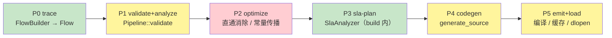
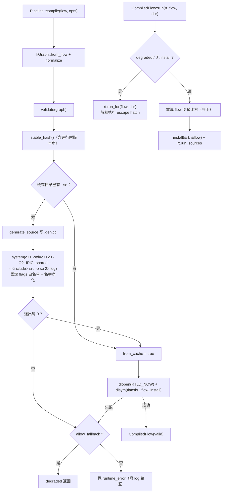

# L1 编译器（`tianshu/compiler`）

> 状态：🟡 部分实现（Phase 1 H2 主战场，待判决）。**已在代码**：IR 降维/拓扑/规范化/稳定哈希/`.dag`+`.conf` 导出（M-A 全量）、P1 结构校验、P4 源码 codegen（M-C 特化编排形态，ADR-0032：`.gen.cc` 按 wire() 同序驱动 `begin_specialize`/`specialize`/`finalize`）、P5 系统编译器调用 + 缓存 + dlopen + degraded 回退（M-B 除 `ti compile` CLI 外全量）、**M-C 逐消息特化全量落地**（dsl 侧快路径 + 通道计划 + H1 逐字节等价 9 用例锁定，差距从 4-7.6× 收敛至脏机 1.3-2×）、H2 三方对比装置（五形状全，金标准已补齐 lineage 语义）与 D8 运行时优化（L1/L1b/L2a/L2b/L2c）、M-D 的 `REGISTER_TRACEABLE_FLOW` 注册表与 dry-run。**未落地**：P2 optimize pass（descope，见 ADR-0032 D6）、`ti compile` 离线编译 CLI、`ti launch` 启动重放接线、H2 正式判决（MC-4，空闲窗口按 §6.1 三轮取数，门槛已重校准为 max(1%, 2ns/跳)）
> 代码：`tianshu/include/tianshu/compiler/{ir.h, pipeline.h, codegen.h}` · `tianshu/src/{ir.cc, pipeline.cc, codegen.cc}`
> 关键 ADR：[ADR-0030 L1 编译器](../../adr/0030-l1-compiler.md)（六阶段管线 / M-A~M-D / 缓存键 = 规范化哈希 / D8 分层优化） · [ADR-0032 逐消息特化](../../adr/0032-per-message-specialization.md)（D4 修正 / 通道计划 / H2 门槛重校准） · [ADR-0001 DSL 形式](../../adr/0001-dsl-form.md)（fluent builder + auto trace 路线） · [ADR-0031 降级阶梯](../../adr/0031-fallback-degradation.md)（`fallback_flow` 的 IR 携带与 conf 导出） · [ADR-0029 SLA 编译](../../adr/0029-sla-compilation.md)（P3 的内容）
> 测试：`tests/compiler/{ir_test.cc, pipeline_test.cc, pipeline_validation_test.cc}` · 基准：`benchmarks/codegen_vs_handwritten.cc` · 示例：`examples/traceable_flow_demo.cc`
> 最后同步：2026-09-17 · M-C 逐消息特化落地（ADR-0032）

## 1. 职责与边界（做什么 / 明确不做什么）

**做什么（as-built）**：

- **IR（D2）**：把 `dsl::Flow` 声明图**升级为**编译器唯一中间表示（`IrGraph`），不另造表示——补齐 `wcet` / 拓扑序 / `normalize()`（规范化）/ `stable_hash()`（缓存键）/ `export_dag()` / `export_conf()`（含 `fallback_flow`，ADR-0031）。
- **from() 全 arity 降维**：无输入 → `source` 节点（源型驱动）；一输入 / 二输入 → `from` 节点（inputs 携带全部输入通道）——2026-09-10 增补（`ir_test.cc` `LowersFromReferencesOfEveryArity`）。
- **P1 结构校验**：`Pipeline::validate` 拒绝重复输出通道与悬空输入（抛 `std::invalid_argument`）。
- **P4 源码 codegen（M-B 范围）**：`generate_source` 产出自包含 `.gen.cc`——拓扑成为编译期常量（注释头 + 常量索引），`tianshu_flow_install` 按规范拓扑序**复放** flow 自己的 stage 闭包（与解释执行同一 `wire()` 语义，内联成带常量下标的直线代码）。
- **P5 产物发射 + 装载**：系统编译器（`$CXX` → `c++`，固定 flags 白名单 `-std=c++20 -O2 -fPIC -shared`）编译成 `.so`，`dlopen` + 固定工厂符号 `tianshu_flow_install`；产物按 **IR 规范化哈希**（含运行时 ABI 版本串）缓存于 `build/tianshu-gen/`；`run()` 前重算哈希守卫，防 flow 与产物错配。
- **escape hatch（D6）**：编译器缺失 / 编译失败 / dlopen 失败 → `allow_fallback`（默认 true）时返回 degraded `CompiledFlow`，`run()` 回落 `FlowRuntime::run_for` 解释执行；`allow_fallback=false` 则抛 `std::runtime_error`。

**明确不做什么（as-built 边界，ADR 目标见 §7）**：

- **不做 P2 优化 pass**（descope，ADR-0032 D6）：直通消除需要 fn 语义可见性，类型擦除后不可判定；结构性改写对 H2 五形状零收益。
- **不消费自己导出的 `.dag`/`.conf`**：两者是审计/溯源产物；当前唯一装载入口是进程内 `Pipeline::compile`（`ti-launch` 消费的是 core 侧 INI `DagConfig`，与本模块无关）。
- **不做静态调度**：codegen 复刻 v0 级联语义，执行模型变更属 Phase 2（[ADR-0019](../../adr/0019-coroutine-strategy.md)）。

## 2. 公共 API 速览

### 2.1 IR（`ir.h`，namespace `tianshu::compiler`）

| 类型 / 函数 | 说明 |
|---|---|
| `IrNode` | `kind`（source / map / join / op / stateful / span / from / sink）· `inputs`（源为空）· `output`（sink 为空）· `type_name`（best effort）· `wcet`（0 = 未声明）· `topo_order` · `decl_index`（指回 Flow 的 per-kind 声明矢量，codegen 由此复放 stage 闭包） |
| `IrGraph::from_flow(flow)` | 纯函数：built Flow（含 WCET / endpoints / SLA 报告 / fallback 名）降维为 IR；内部先排拓扑 |
| `IrGraph::compute_topo()` | Kahn 拓扑排序，平局按 `(joined inputs, output)` 字典序（语义锚点断平局，**不用**匿名通道号——那是 normalize 要吸收的差异）；反馈环节点（`map_to` 写回）确定性缀在无环前缀后 |
| `IrGraph::normalize()` | 规范化：匿名通道（`/~`）按规范遍历序重编号、节点排序、规范名上重跑 topo——不同 builder 调用序声明的同构图在此收敛 |
| `IrGraph::stable_hash()` | 规范化序列化上的 64-bit FNV-1a（十六进制串）；**缓存键**。序列化含 `tianshu_version_string()`——库升级自动失效旧产物（ADR-0030 风险项"运行时 ABI 哈希"的落地） |
| `IrGraph::export_dag()` / `export_conf()` | TOML 风格导出：`.dag` = 拓扑 + 通道表 + hash；`.conf` = `sla_ok` / `[[sla]]` / `[[budget]]` / `saturation` / `fallback_flow`（空则省略，向后兼容，ADR-0031） |
| 访问器 | `flow_name()` · `nodes()` · `endpoints()` · `sla()` · `fallback_flow()` |

### 2.2 管线与产物（`pipeline.h`）

| 类型 / 函数 | 说明 |
|---|---|
| `CompileOptions` | `cache_dir`（默认 `"build/tianshu-gen"`，源码与编译日志随 `.so` 同目录供审计）· `compiler`（空 → `$CXX` → `"c++"`）· `allow_fallback`（默认 true；false 时编译失败抛错不降级） |
| `CompiledFlow` | move-only RAII（析构 `dlclose`）：`valid()`（已装载产物）· `degraded()`（将走解释器）· `from_cache()` · `hash()` · `artifact_path()` · `run(rt, flow, duration)` |
| `CompiledFlow::run()` | degraded → `rt.run_for`（escape hatch）；否则重算 `IrGraph::from_flow + normalize + stable_hash` 与产物键比对（不符抛 `invalid_argument`），再调产物的 `tianshu_flow_install(&rt, &flow)` 安装接线、`rt.run_sources` 驱动源 |
| `Pipeline::validate(graph)` | P1：重复通道生产者 / 悬空输入 → `std::invalid_argument` |
| `Pipeline::compile(flow, options)` | P4+P5：normalize → hash → 缓存查 → codegen → 系统编译器 → dlopen → `dlsym(tianshu_flow_install)`；要么 valid 要么 degraded，不出"无效且未降级"的中间态 |

### 2.3 codegen（`codegen.h`）

| 函数 | 说明 |
|---|---|
| `generate_source(graph)` | 产出 `.gen.cc` 全文（期望输入已 normalize）。导出两个 C 符号：`tianshu_flow_hash()`（返回产物哈希）与 `tianshu_flow_install(FlowRuntime*, const Flow*)`（M-C 形态，ADR-0032：`begin_specialize` → 按 wire() 同序逐节点 `specialize`（map/join/sink，缺钩子回退 `wire`）或 `wire`（op/stateful/span/from）→ `finalize` 冻结扇出绑定；拓扑以注释呈现，安装序 = 解释执行注册序） |

### 2.4 真实用法（摘自测试 / 示例）

```cpp
// 来源：tests/compiler/pipeline_test.cc（CompiledMatchesInterpreter）——
// 产物输出 = 解释执行输出（M-B 验收：expect_matching_outputs 逐条比对）
auto compiled =
    compiler::Pipeline::compile(make_chain("pipe_e2e", &compiled_out),
                                cache_opts(cache_dir()));
ASSERT_TRUE(compiled.valid());
EXPECT_FALSE(compiled.degraded());
{
  dsl::FlowRuntime rt;
  compiled.run(rt, make_chain("pipe_e2e", &compiled_out),
               std::chrono::milliseconds(120));
}

// 来源：tests/compiler/ir_test.cc（LowersFromReferencesOfEveryArity，
// 2026-09-10 新增）——from() 三种 arity 的 IR 降维
const auto ticks  = b.from<TickMsg>("ir.from.driver", "drv", std::chrono::milliseconds(10));
const auto dets   = b.from<TickMsg, DetectMsg>("ir.from.pass", ticks, "det");
b.from<FuseMsg>("ir.from.fuse", ticks, dets, "fused")
    .sink([](const FuseMsg&, const tianshu::core::Lineage&) {});
const auto graph = compiler::IrGraph::from_flow(b.build());
// src->kind == "source"（无输入）；pass->inputs == {"ir_froms/drv"}；
// fuse->inputs == {"ir_froms/drv", "ir_froms/det"}

// 来源：examples/traceable_flow_demo.cc（M-D dry-run + 编译 + fallback 阶梯）
REGISTER_TRACEABLE_FLOW("demo_traceable", declare_demo_flow)
const auto flow = tianshu::dsl::build_registered_flow("demo_traceable");  // build 即 trace
auto graph = tianshu::compiler::IrGraph::from_flow(flow);
graph.normalize();
std::printf("artifact hash: %s\n", graph.stable_hash().c_str());
auto compiled = tianshu::compiler::Pipeline::compile(flow);
compiled.run(runtime, flow, std::chrono::milliseconds(60));
```

## 3. 内部设计

### 3.1 六阶段管线：代码现状 vs ADR 设计



图例：绿 = 已在代码且达 ADR 语义 · 黄 = 部分实现（见下表）· 红 = 未落地（仅 ADR-0030 D3 设计）。

| Pass | ADR-0030 D3 设计 | as-built 现状 |
|---|---|---|
| P0 trace | flow 函数 → 声明图；dry-run 形态 M-C/M-D 再补 | ✅ `FlowBuilder::build()` 即 trace 产物；M-D 的 `REGISTER_TRACEABLE_FLOW` + `build_registered_flow(name)` 已提供按名 dry-run |
| P1 validate+analyze | 图合法性（悬挂通道 / 类型一致 / 环检测）、拓扑排序 | 🟡 `Pipeline::validate` 只做**结构**校验（重复输出 / 悬空输入）；类型一致性与环**拒绝**未做——环（`map_to` 反馈）被 `compute_topo` 确定性尾排**接受**，类型信息在 IR 里只剩 `type_name` 字符串 |
| P2 optimize | 直通消除 + 常量通道传播 | ❌ 未落地，管线中无此阶段 |
| P3 sla-plan | ADR-0029 分析器，判定写 `.conf` | ✅ 分析在 `FlowBuilder::build()` 内执行（不在本管线内），`IrGraph` 携带其报告，`export_conf()` 落盘判定与预算表 |
| P4 codegen | 自包含 `.gen.cc`；D4：算子 lambda 内联进 dispatch | ✅ M-C 形态（ADR-0032，D4 修正为类型化宿主钩子）：`specialize` 钩子（host 模板实例化）+ 常量编排安装；逐消息快路径在 dsl 侧 `FastMap/FastJoin/FastSinkStage`（直连 CacheBuffer、单指针擦除、自持 seq、常量扇出） |
| P5 emit+load | 编译、缓存、dlopen、工厂绑定 | 🟡 全量落地（含哈希守卫与 degraded 回退），但 `ti compile` CLI（D7 的 M-B 交付物）未实现 |

### 3.2 compile → 装载 → 运行（`pipeline.cc`）



机制要点：

- **缓存键 = 规范化哈希**（D1）：`stable_hash` 消化"同图不同声明序"（匿名通道重编号 + 节点排序 + 规范名重排 topo，`ir_test.cc` `HashIsInsensitiveToDeclarationOrder` 锁定）；键内掺入 `tianshu_version_string()`，库升级旧缓存自动失效。缓存目录三件套：`<name>.<hash>.so` / `.gen.cc`（审计用，D6） / `.compile.log`。
- **命令行安全姿态**（D6）：编译命令由固定 flags 白名单 + `sanitize_name`（非 `[A-Za-z0-9_.-]` 一律 `_`）拼装，编译器二进制来自 `CompileOptions`/环境而非 flow 输入；`std::system` 调用带 NOLINT 标注。
- **include 解析**：`TIANSHU_GEN_INCLUDE_DIR` 宏优先（CMake 注入），否则回退 `"tianshu/include"`（Bazel runfiles cwd 布局同构）。
- **run 的哈希守卫**：`ArtifactRejectsForeignFlow`（拓扑多一跳 map 即哈希不符）证明产物拒绝服务不匹配的 flow——这是"产物 ↔ 声明图"可溯源闭环的运行期半边；编译期半边是 `.conf` 里的 `hash` 字段。
- **move 语义**：`CompiledFlow` move-only，move 后源失效、目标继承 `dlclose` 义务（`MovedFromIsValidAndReleasesArtifact` 全路径锁定）。

### 3.3 生成的 `.gen.cc` 形态（`codegen.cc`）

```text
// Generated by the tianshu L1 pipeline (ADR-0030). Do not edit.
// flow: <name>  hash: <hash>
// topology (canonical order):        ← 拓扑即注释，审计可读
#include "tianshu/dsl/dsl_runtime.h"

extern "C" const char* tianshu_flow_hash() { return "<hash>"; }

extern "C" void tianshu_flow_install(tianshu::dsl::FlowRuntime* rt,
                                     const tianshu::dsl::Flow* flow) {
  flow->maps()[2].wire(*rt);      // 常量 decl_index，规范拓扑序
  flow->joins()[0].wire(*rt);
  ...
}
```

`wire_accessor` 按 kind 映射到 Flow 的声明矢量（maps/joins/ops/statefuls/spans/froms/sinks；source 无条目——由 run loop 驱动）。M-B 的保守 wire 复放已被 M-C 特化编排取代（ADR-0032）：安装序刻意保持 wire() 的 per-kind 声明序（dispatcher 通知序与消费者扇出序与解释执行逐位相同），map/join/sink 走 `specialize` 钩子进 dsl 侧快路径，op/stateful/span/from 复放 `wire`。H1 逐字节一致由 `tests/dsl/specialize_test.cc`（9 用例）与 `CompiledMatchesInterpreter` 双重锁定；特化的机制细节（通道计划 / LineageInbox / 语义收窄）见 [modules/dsl.md](./dsl.md) §3 与 ADR-0032。

### 3.4 H2 三方对比装置（`benchmarks/codegen_vs_handwritten.cc`，D5/D8）

- **三方**：handwritten（`CacheBuffer` + `DataDispatcher` 手工接线，金标准，只付 1 次自旋锁 + 1 次哈希查找 + 1 次缓冲填充）· interpreted（`FlowBuilder` → `FlowRuntime`）· compiled（`Pipeline::compile` 产物，`run(rt, flow, 0ms)` 只装接线不驱动定时源，再 `publish_bytes` 灌 1M 条）；源处 `born_ns` 打进 payload、sink 处测 e2e，P50/P99/P99.9 进 benchmark counters。
- **as-built 形状**：short（1 map）/ medium（4）/ long（9）三条线性链 + **fan-in**（3 源经嵌套双 join 收敛：DSL v0 join 为二元，roadmap "(A,B,C)→D" 以 J1(A,B)+J2(J1,C) 表达，5 级）+ **fan-out**（1 源喂 4 条分支 map，各带 sink，每次投递计一条样本）——**五形状 × 三方齐备**（roadmap §1.3 全形状，2026-09-16）。
- **D8 实施记录（2026-09-08）**：实测基线解释执行落后手写 4.4×–6.2×，差距逐项定位到运行时通用路径（互斥锁 / 字符串哈希 ×3-4 / 血缘拷贝 / 分支向量堆分配）；分层修复 L1（单查找上下文）、L1b（稳态无锁 + 反馈通道每通道自旋锁修正）、L2a/L2b/L2c（末端移动语义 / SmallVec 血缘内联 / 历史负载内联）**全部落地**，290/290 + 27/27 护航。**判决数字必须在空闲机取**（开发宿主机 load 2-16 波动，锁持有路径争用下不成比例劣化）——这是 H2 尚未正式裁定、模块状态保持 🟡 的直接原因。
- **勘误（2026-09-16）**：本段与 ADR-0030 实施记录所引"手写三形状基线应复现 ~50/110/360ns"中 **medium=110 不可复现**——空闲大核实测 180、空闲小核 261、退回 D8 态代码（`62b21aa`）亦 171；ADR 正文 D8 基线表的 260 与小核空闲实测吻合（疑为小核采样）。"空闲实测中链 p50 −52%"同样未确定性复现（当前空闲大核中链解释执行 p50 ≈ 1.05-1.09µs，较 D8 表 1182ns 仅 −8~12%）。有效环境判据以 §6.1 重定基线为准。

## 4. 与其它模块的关系

- **dsl（上游与运行底座）**：IR 输入是 `dsl::Flow`（`sources()/maps()/joins()/ops()/statefuls()/spans()/froms()/sinks()/sla_endpoints()/sla_report()/wcet_by_out()/fallback_flow()`）；产物 install 复放的是 `dsl_runtime.h` 的 `wire()` 工厂（`make_map_wire` 等），degraded 回落 `FlowRuntime::run_for`。D8 的运行时优化（L1/L2 层）改的是 `dsl_runtime`，本模块是其验证装置的消费者。
- **sla**：`IrGraph` 携带 `sla::SlaEndpoint` 矢量与 `sla::SlaReport`；`export_conf` 把 SLA 判定与预算表写进产物（ADR-0030 需求 6：P3 判定结果写 `.conf`）。
- **base / core**：经 dsl 间接依赖（`SmallVec`、`DataDispatcher`、`Lineage`）；benchmark 直用 `base::CacheBuffer` + `core::DataDispatcher` 构造手写金标准。
- **cli**：ADR-0030 D7 规划 `ti compile`（M-B 交付物）——**未实现**；`ti-launch` 当前装载的是 core 侧 INI `DagConfig` 组件图，与本管线无交集（M-D 的"ti launch 启动重放"是未来接线点）。
- **version**：`tianshu/version.h` 的 `tianshu_version_string()` 进缓存键。

## 5. 设计决策与被否方案（ADR 摘要）

| # | 决策 | 被否方案与理由 | 出处 |
|---|---|---|---|
| 1 | **源码 codegen + 系统编译器成 `.so`** | LLVM JIT（ORC/Cranelift）：工具链体积与 ADR-0005 依赖治理冲突、产物不可人读（认证成本高）、`-O3` 已够零开销 | [ADR-0030 D1](../../adr/0030-l1-compiler.md) |
| 2 | **声明图即 IR**，不另造中间表示 | 双表示（DSL 图 + 独立 IR）：pass 间契约分裂、同步成本；IR 是唯一 pass 间契约，pass 不触碰 DSL 类型 | D2 |
| 3 | **六阶段 pass 管线**，v0 进程内一次执行 | 落盘中间产物的多趟编译：Phase 1 无必要；`ti compile` 离线形态留 M-B（CLI 未实现） | D3 |
| 4 | **与手写逐符号对齐**（同一 `wire()`/dispatch API、同一内联头） | codegen 绕开 DataDispatcher 直写 transport：偏离等价基线，H1 逐字节一致难证 | D4 + 被否表 |
| 5 | **三方对比装置**（手写为金标准） | 两方对比（产物 vs 解释执行）：解释执行仅回归参考，无金标准则 <1% 无从判 | D5 |
| 6 | **escape hatch**：编译失败自动降级解释执行 + 白名单 flags + `.gen.cc` 可审计 | 编译失败即硬错：无编译器环境（mcu/沙箱）不可用；产物不可读则认证场景无法人审 | D6 |
| 7 | **缓存键 = IR 规范化哈希（含运行时 ABI 串）** | 只哈希源声明：builder 调用序扰动导致无谓重编；不含版本串则库升级后旧 `.so` ABI 错配静默加载 | D1 + 风险节 |
| 8 | DSL 形式 = **C++ fluent builder + auto trace** | 表达式模板（编译时间爆炸、错误信息灾难）；YAML 外部 DSL（类型检查弱、与 `.dag` 区分度低）——trace + codegen 路线承自 JAX / torch.compile | [ADR-0001](../../adr/0001-dsl-form.md) |
| 9 | fallback 名随 IR / `.conf` 携带（空则省略，向后兼容） | 不进产物：声明图与产物不可溯源对应 | [ADR-0031](../../adr/0031-fallback-degradation.md) D1 |
| 10 | **M-C 特化 = 类型化宿主钩子 + Flow 自推导计划**（D4 修正：类型墙使 `.gen.cc` 内联算子体不可行）；门槛重校准 max(1%, 2ns/跳) | 纯运行时 mode 开关（丢产物可审计性与缓存锚点）；DSL v1 表达式模板（ADR-0001 已否）；join 单槽 inbox（配对积累丢血缘） | [ADR-0032](../../adr/0032-per-message-specialization.md) |

## 6. 测试 / 基准 / 示例入口

- `tests/compiler/ir_test.cc`（9 用例，M-A 验收）：降维 kinds+WCET · 拓扑生产者在前 · 哈希跨运行稳定 · **哈希对声明序不敏感**（双分支 join 两种声明序收敛）· `.dag` 导出含全通道与 hash · `.conf` 与 SlaReport 预算一致 · normalize 保节点数与匿名形状（幂等）· 全节点种类降维（source/map/op/stateful/span）· **from() 全 arity 降维**（2026-09-10）。
- `tests/compiler/pipeline_test.cc`（4 用例，M-B 验收）：产物输出 = 解释执行输出 · 二次编译命中缓存 · 编译器缺失 degraded 但仍出全部输出 · 产物拒绝外来 flow（哈希守卫）。
- `tests/dsl/specialize_test.cc`（9 用例，M-C H1 验收，ADR-0032）：五形状 / 多生产者 / 混合 op / SLA 回退 / 历史收窄 / 录制内容 / 回放——`wire_specialized` 与 `wire` 逐字节等价（值 + 血缘 describe 字节）。
- `tests/compiler/pipeline_validation_test.cc`（5 用例，D6 降级路径）：悬空输入 / 重复生产者结构拒绝（经 `IrGraphTestPeer` 友元注入故障图——公共 IR 面刻意不可变）· 良形图通过 · strict 模式抛 `runtime_error` · `CompiledFlow` 移动语义全路径。
- 基准：`benchmarks/codegen_vs_handwritten.cc`——5 链形 × 3 实现各 1M 条（fan-out 4M 样本），P50/P99/P99.9 counters；运行 `./build/desktop-release/bin/codegen_vs_handwritten --benchmark_min_time=1s`。**H2 判决数字必须按 §6.1 测量协议取**。
- 示例：`examples/traceable_flow_demo.cc`（M-D：注册表枚举 → 按名 dry-run trace → SLA 报告 / artifact hash / fallback 阶梯打印 → 编译运行 → `fallback_state()`）。

### 6.1 H2 判决测量协议（2026-09-16 实机验证）

开发宿主机为**异构 CPU**（AMD Ryzen AI 9 HX 370：逻辑 0-3 / 12-15 = Zen5 大核，5.16GHz + 16MB L3 簇；其余 16 线程 = Zen5c 小核，3.29GHz + 8MB L3 簇）。不绑核时调度器会把单线程 benchmark 挪到大核；**若显式绑到小核，全部数字无声放大 ~1.8×**（实测手写 short 50→90ns、long 331→561ns）——判决跑法必须绑大核。

**有效环境判据**（空闲 + 大核 + performance governor；三轮 p50 应一字不差）。⚠️ 2026-09-17 起金标准补齐 lineage 语义（ADR-0032 D5，同语义基线），旧无血缘基线（50/180/331）作废。**R1 盾内基线（tools/h2_shield.sh，三轮，p50 波动 ≤10ns 未达一字不差严格判据，量级可信）**：

| 手写（带血缘） | short | medium | long | fan-in | fan-out |
|---|---|---|---|---|---|
| p50 | 80-90 ns | 271-280 | 642-662 | 361-371 | 351-360 |
| p99 | 110 | 311-321 | 711-721 | 401-411 | 491 |

p99 显著抬头即环境被扰动，数字不作数。扇入/扇出参考值（2026-09-16 单轮盾内，**转正判据前须三轮复验**）：fan-in 手写 p50 201 / p99 211，fan-out 手写 p50 270 / p99 361。取数步骤（cgroup v2 盾，把 user/system 两个 slice 挤出大核物理核 3 = 逻辑 3+15）：

```bash
echo performance | sudo tee /sys/devices/system/cpu/cpu*/cpufreq/scaling_governor
sudo systemctl set-property --runtime user.slice  AllowedCPUs=0-2,4-14,16-23
sudo systemctl set-property --runtime system.slice AllowedCPUs=0-2,4-14,16-23
sudo mkdir /sys/fs/cgroup/tianshu-bench
echo "3,15" | sudo tee /sys/fs/cgroup/tianshu-bench/cpuset.cpus
echo 0      | sudo tee /sys/fs/cgroup/tianshu-bench/cpuset.mems
./build/desktop-release/bin/codegen_vs_handwritten --benchmark_min_time=1s &
echo $! | sudo tee /sys/fs/cgroup/tianshu-bench/cgroup.procs  # 先进组（此时亲和继承 housekeeping）
taskset -pc 3 $!                                            # 再绑核（顺序反了则亲和交集为空，进程无法调度）
# 还原：sudo rmdir /sys/fs/cgroup/tianshu-bench
#       sudo systemctl set-property --runtime user.slice  AllowedCPUs=0-23   # 注意：置 "" 不生效，须显式全量
#       sudo systemctl set-property --runtime system.slice AllowedCPUs=0-23
#       echo powersave | sudo tee /sys/devices/system/cpu/cpu*/cpufreq/scaling_governor
```

## 7. 已知限制与演进方向

- **P2 optimize 未落地**：直通消除与常量传播还在 ADR-0030 D3 表里；当前优化全部依赖 `-O2` + D8 运行时层。落地时管线在 `validate` 与 SLA 报告携带之间插入改写阶段（需同步 `stable_hash` 语义：优化应幂等于规范化）。
- **codegen 未做逐消息特化**（M-C 核心）：产物复放 wire 语义，per-message 路径仍是运行时通用路径；D4 的"算子 lambda 内联进 dispatch 回调 + SLA 预算 `static_assert` 级注释 + 直方图挂点"待 M-C 交付。
- **H2 判决 R1（2026-09-17 盾内三轮）：五形状全 FAIL** — 差值 short +101 / medium +170 / long +210 / fan-in +460 / fan-out +139 ns，折 21-92ns/跳 vs 门槛 ≤2ns/跳，差一个数量级；compiled 对解释执行快 3.2-4.3×（机制收益真实），H1 逐字节一致（9 用例）。归因进行中：盾内 ≈ 脏机证明差距是**结构性**的（固定入口项 ~100-130ns + 每跳 8-23ns 非线性，medium 每跳贵过 long 反常待解释；fan-in 病态最重）。回炉方向排队：入口整段特化（产物导出类型化发布入口绕过 publish_bytes 通用段）/ fan 扇出去虚化 / join 快路径重做；下一轮先 perf 逐符号归因再动刀（修复纪律：预言不中不叠改）。
- **P1 分析面窄**：无类型一致性检查（IR 层类型已擦除为字符串）、环不被拒绝只被确定性排序——完整 analyze 语义待 M-C。
- **`ti compile` CLI 缺位**：离线预编译（车端冷启动秒级首编译的主要缓解）只能经进程内 `Pipeline::compile` + 缓存目录复用间接达成。
- **`.dag`/`.conf` 无消费方**：装载路径不读它们（守卫靠运行期重算哈希）；`ti launch` 接 dry-run 重放（M-D 收尾）后它们才成为装载输入。
- **加载期编译时延**：首编译一条中链秒级（进程内 `c++` 调用）；profile 语义规划 `vehicle` 以上默认 AOT、`mcu` 永远 AOT（ADR-0030 风险节），依赖 `ti compile` 落地。
